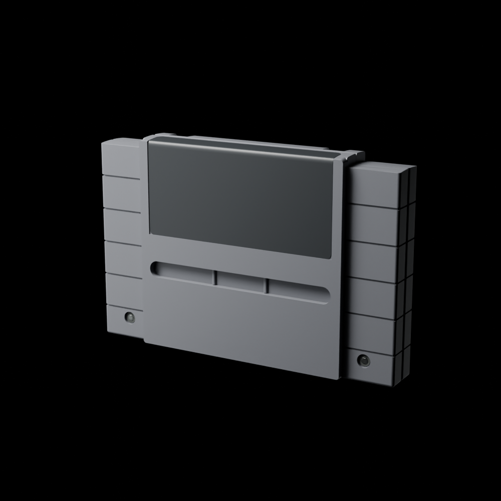
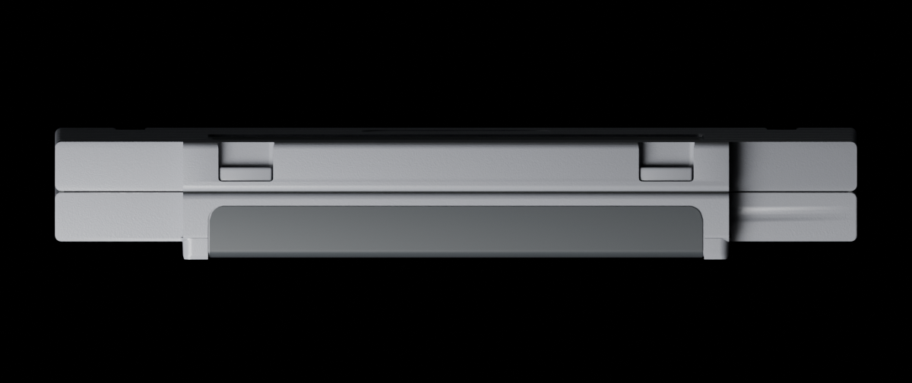
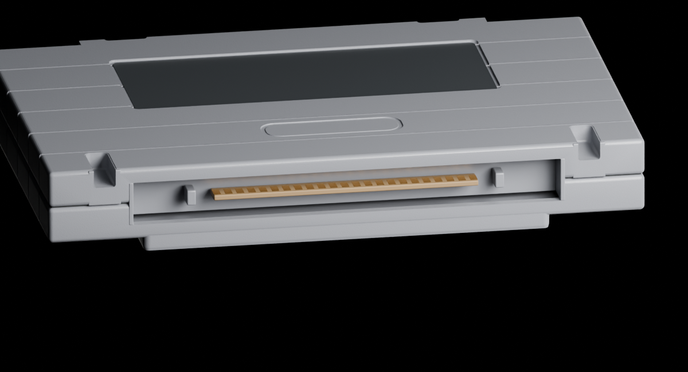

# SNES early North American cartridge

**Version:** 0.1.0 · **Creator:** Lincoln Aleixo · **License:** CC BY-NC-ND 4.0, within the scope described in the root NOTICE.md.

| Top | Underside |
| --- | --- |
|  |  |

[Download Blender + GLB package](https://github.com/lincolnaleixo/retro-cartridge-models/releases/tag/snes-ntsc-u-v0.1.0) · [Manifest and checksums](versions/0.1.0.json) · [Changes](CHANGELOG.md)

The model represents the early North American locking-slot shell. The top is crowned across its depth, with a continuous folded label surface. Both lower latch recesses have solid inner backing; the central connector aperture remains open. Grip mouths and wing roofs have softened edges. The public model has blank labels and no logo mesh.

The nominal envelope is approximately 135.4 × 88 × 19.9 mm. These dimensions and detail profiles are inferred from references, not official Nintendo manufacturing specifications. This is a visualization asset, not a fit-certified replacement shell or a print-ready engineering part.

The GLB is self-contained, uses meters, Y-up, +Z front, and includes no camera, lights or floor. The editable Blender file includes the studio scene used for previews. See the version manifest for the measured exported bounds and validation results.
