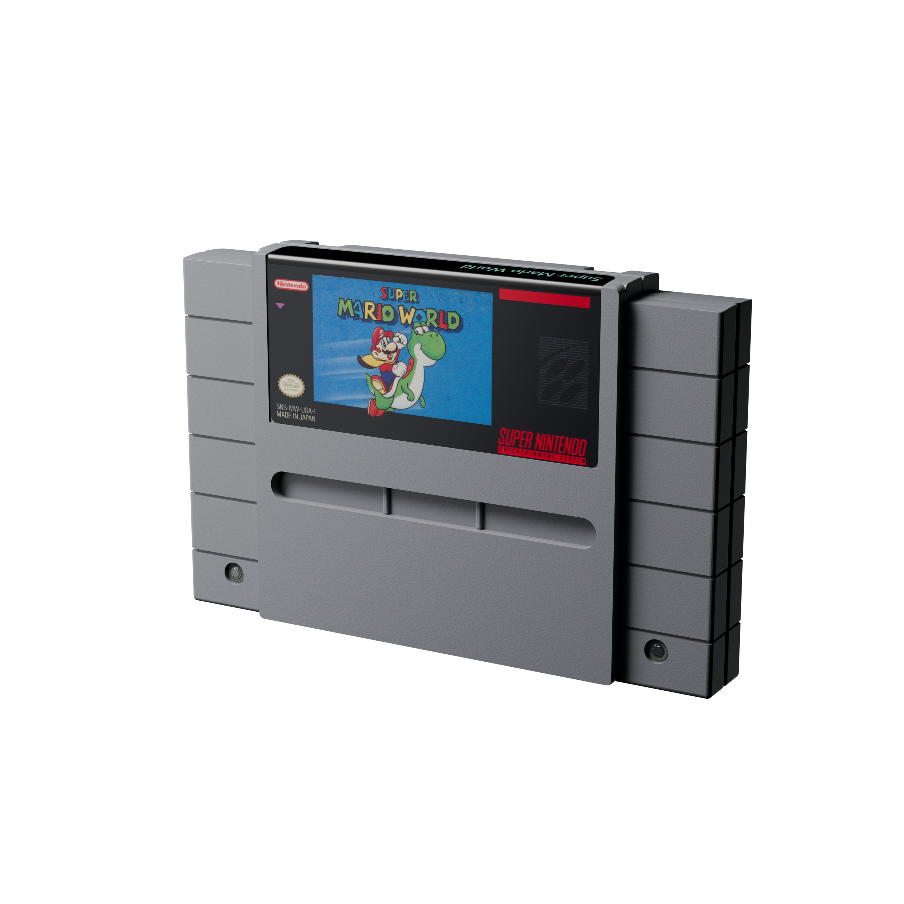

# SNES — Super Mario World example

**Version:** 0.1.0 · **Reconstruction:** Lincoln Aleixo

[Explore in 3D](https://lincolnaleixo.github.io/retro-cartridge-models/#snes-super-mario-world) · [Download release](https://github.com/lincolnaleixo/retro-cartridge-models/releases/tag/snes-super-mario-world-v0.1.0) · [Changelog](CHANGELOG.md)

The existing Super Mario World demonstration, including its restored front label, folded top title, rear warning label and molded emblem. The geometry retains the crowned top and backed lower latch recesses. This is an approximate reconstruction for visualization, not an official manufacturing model.

The package includes editable Blender source, a self-contained GLB and five renders. It uses meters, Y-up and +Z front. Camera, lights and floor are excluded from the GLB.

Original reconstruction contributions are CC BY-NC-ND 4.0. Super Mario World artwork and Nintendo marks remain third-party content and are excluded from that grant; this example does not provide an open license to those elements. The collection is not affiliated with Nintendo. See [credits](CREDITS.md) and the root [NOTICE.md](../../NOTICE.md).
